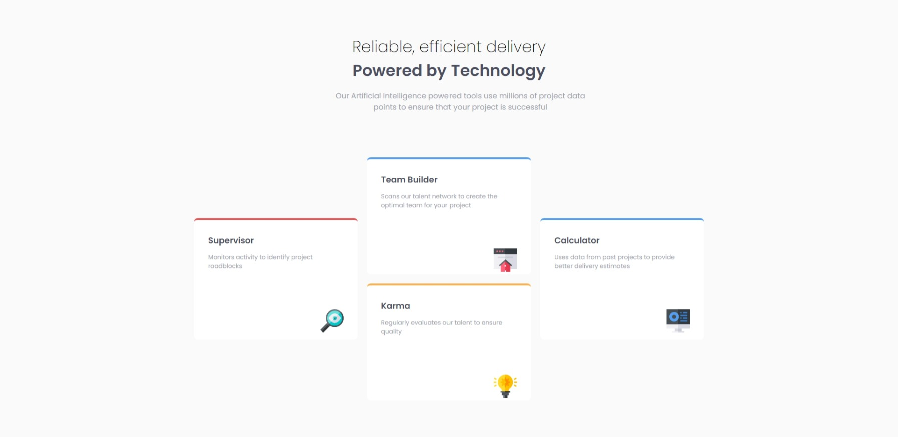
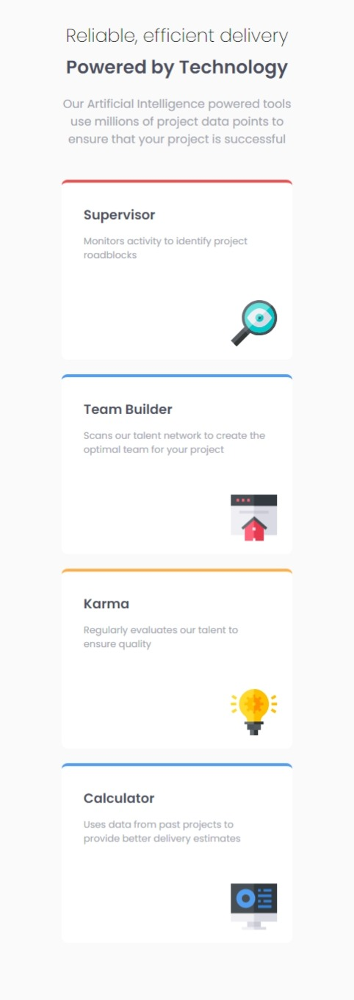

# Frontend Mentor - Four card feature section solution

This is a solution to the [Four card feature section challenge on Frontend Mentor](https://www.frontendmentor.io/challenges/four-card-feature-section-weK1eFYK). Frontend Mentor challenges help you improve your coding skills by building realistic projects. 

### Screenshot

- Desktop

- Mobile

### Links

- Solution URL: [https://onfiire.github.io/FourCard/](https://onfiire.github.io/FourCard/)

### Built with

- CSS Grid

## Author

- Frontend Mentor - [@onfiire](https://www.frontendmentor.io/profile/onfiire)
